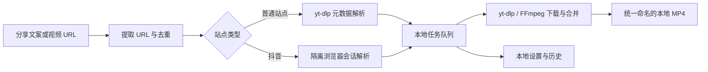

# XL-FenBao Study｜粉包学习记

把散落在网页和分享文案中的公开视频，整理成可长期保存、可继续学习的本地资料。

[](LICENSE)
[](#运行环境)
[](#技术结构)

> XL-FenBao Study 是 [XL-FenBao](https://github.com/k4ubx7/XL-FenBao) 的配套采集工具：它负责把你有权保存的视频带回本地；视频中经过学习、验证和提炼的内容，才适合进一步进入个人 AI 工程资产系统。

## 它解决什么问题

真正有价值的学习材料经常分散在抖音、Bilibili、YouTube 和其他网页里。只收藏链接会受到失效、下架和平台切换影响，随手下载又容易留下混乱的文件名和目录。

粉包学习记提供一个本地优先的整理入口：

- 粘贴一个或多个视频链接，也可以直接粘贴整段分享文案。
- 自动提取 URL、识别视频信息并按平台与视频 ID 去重。
- 使用统一的日期、平台、作者、标题和 ID 生成文件夹与文件名。
- 通过任务队列显示解析、下载、合并、失败和完成状态。
- 保存本地设置与历史记录，重新启动后可以继续查看。
- 下载结果保持克制：每个视频一个同名文件夹，默认只保留一个 MP4。

它不是视频分析平台，也不会自动把未经验证的内容写入 XL-FenBao。下载只是知识采集的开始，不是知识沉淀的完成。

## 功能概览

- **分享文案解析**：从混合文本中提取并去重 HTTP/HTTPS 链接。
- **多站点下载**：普通站点交给 `yt-dlp` 解析；实际支持范围取决于当前 `yt-dlp` 版本和目标网站。
- **抖音适配**：当普通解析不可用时，使用隔离的 Edge/Chrome 浏览器会话识别当前视频流。
- **下载队列**：支持 1–3 个并发任务、画质预设、实时进度、取消和失败重试。
- **本地历史**：任务状态以原子方式写入本地 `state.json`，默认最多保留 500 条历史。
- **便携目录**：正式构建中的程序、`data` 和 `downloads` 可以随文件夹一起移动。
- **隐私隔离**：不会读取日常浏览器配置；抖音交互登录只保存在应用自己的数据目录。

## 工作方式



默认输出结构：

```text
downloads/
└─ 2026-07-23_平台_作者_标题_ID/
   └─ 2026-07-23_平台_作者_标题_ID.mp4
```

## 运行环境

当前版本面向 Windows 10/11 x64：

- Node.js 22 或更高版本；建议使用 Node.js 24 LTS。
- 本机安装的 Microsoft Edge 或 Google Chrome，用于抖音隔离浏览器解析。
- `yt-dlp.exe`、`ffmpeg.exe` 和 `ffprobe.exe`，放在 `vendor/bin/`。

仓库不会提交这些第三方可执行文件。来源、版本与校验说明见 [`vendor/bin/README.md`](vendor/bin/README.md)，完整准备过程见 [`docs/BUILDING.md`](docs/BUILDING.md)。

## 本地开发

```powershell
git clone https://github.com/k4ubx7/XL-FenBao-Study.git
Set-Location XL-FenBao-Study
npm ci
npm run dev
```

没有准备第三方可执行文件时，界面仍可用于开发和预览，但真实解析、下载和端到端测试无法完整运行。

常用验证命令：

```powershell
npm test
npm run typecheck
npm run build
npm run test:e2e
```

`npm run test:e2e` 需要 `vendor/bin/` 中的工具。真实抖音检查默认跳过；只有显式设置 `FENBAO_DOUYIN_URL` 时才会运行。

## 构建便携版

准备好第三方工具后执行：

```powershell
npm run pack
```

Windows 便携目录会生成在 `release/win-unpacked/`。发布前请按 [`docs/RELEASING.md`](docs/RELEASING.md) 完成检查，不要把本机 `data/`、`downloads/`、Cookie、日志或测试媒体打入发布包。

## 技术结构

```text
src/
├─ main/       Electron 主进程、任务队列、站点解析、下载与状态持久化
├─ preload/    经过收敛的 IPC 桥接接口
├─ renderer/   React 界面、队列、历史与设置
└─ shared/     主进程与渲染进程共享的数据契约

tests/
├─ unit/       URL、命名、队列、状态、安全错误映射等单元测试
├─ renderer/   界面行为测试
└─ e2e/        Electron、本地媒体和可选真实站点测试
```

主要技术栈：Electron、React、TypeScript、Zustand、Zod、Vitest、Playwright、yt-dlp 与 FFmpeg。

## 安全与隐私边界

- Electron 渲染层启用 `contextIsolation` 和沙箱，关闭 Node 集成及 WebView。
- 外部导航、窗口打开和权限请求默认拒绝。
- 下载进程不经过 Shell 拼接命令，错误消息会隐藏 Cookie、Token、账号和参数值。
- 开发数据位于 `.dev-data/`；便携版数据位于程序目录下的 `data/`。
- 抖音需要交互登录时，会使用 `data/douyin-browser/` 中的隔离浏览器配置；它不会读取你日常浏览器的个人资料。
- `data/` 中可能包含登录 Cookie 和浏览历史，因此不得上传、打包或发送给他人。

安全问题请查看 [`SECURITY.md`](SECURITY.md)。

## 使用边界

本项目只帮助用户保存自己有权下载的公开内容：

- 不绕过登录、付费、地区限制、DRM、验证码或其他访问控制。
- 不保证任何第三方平台长期可用；网站结构和规则变化可能导致解析失败。
- 工具和源码的开源许可不代表视频内容获得授权。
- 使用者需要自行遵守内容版权、目标网站条款和所在地法律。

## 与 XL-FenBao 的关系

XL-FenBao 是个人 AI 工程能力的系统容器，XL-FenBao Study 是可选的学习材料入口。推荐流程是：

1. 用本工具把有权保存的视频整理到本地。
2. 使用 AI 或人工方式学习、转录和提炼内容。
3. 在真实任务中验证方法、Skill 或素材是否有效。
4. 只有通过验证的内容，才进入 XL-FenBao 的知识、方法论、Skill 或 Asset 区域。
5. 为沉淀结果补充来源、适用范围和调用地图。

两个项目彼此独立：不使用 XL-FenBao 也可以运行本工具，不安装本工具也可以使用 XL-FenBao。

## 贡献

欢迎修复文档、测试、站点适配、可靠性和隐私问题。提交前请阅读 [`CONTRIBUTING.md`](CONTRIBUTING.md)。不要提交真实 Cookie、下载记录、媒体文件或来历不明的第三方二进制。

## 许可证

项目自身源码采用 [Apache License 2.0](LICENSE)，Copyright 2026 `k4ubx7`。

`yt-dlp`、FFmpeg、Playwright 及其他第三方组件保留各自许可证；详见 [`THIRD_PARTY_NOTICES.md`](THIRD_PARTY_NOTICES.md)。发行包含第三方二进制的便携包时，发行者需要独立履行对应许可证义务。
